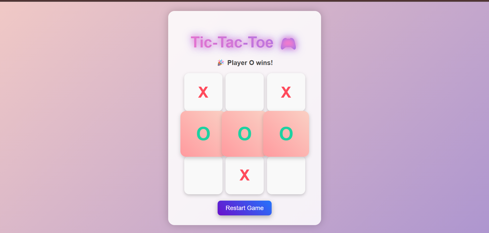

# 🎮 **Tic-Tac-Toe 2-Player Game**

## 🌟 **Overview**

Welcome to **Tic-Tac-Toe 2-Player Game** – a **fun, interactive, colorful, and fully animated XOX game** built with **HTML, CSS, and JavaScript**.  

This is a **2-player game** where players take turns marking **X** and **O** on a **3x3 grid**. The player who aligns **three marks in a row, column, or diagonal wins**.  

## 🎨 **Features**

- ✅ **2-player mode** (Player X vs Player O)  
- ✅ **Colorful, animated, gradient-based UI**  
- ✅ **Hover effects** and **winning cell animations**  
- ✅ **Restart button** to play again  
- ✅ Fully **responsive and mobile-friendly**  
- ✅ Lightweight and fast  

## 🕹 **How to Play**

1. Open the game in a browser.  
2. Player **X** starts first.  
3. Click on any empty cell to place your mark.  
4. Players take turns until one wins or the board is full.  
5. Click **Restart Game** to play again.  

## 💻 **Technologies Used**

- **HTML5** – Structure and layout  
- **CSS3** – Animations, gradients, responsive design  
- **JavaScript** – Game logic, win checking, player turns  

## 🚀 **How to Run Locally**

1. Clone this repository:

git clone https://github.com/swathi-gurijala/Tic-Tac-Toe-Game.git

## Navigate to the project folder:
- cd Tic-Tac-Toe-Game
- Open index.html in your browser.

## 🔧 Project Structure

Tic-Tac-Toe-Game/
├── index.html       # Main HTML file
├── style.css        # CSS styling and animations
└── script.js        # JavaScript game logic

## 📝 Contributions
Feel free to fork, clone, and modify this project.
Pull requests are welcome to improve UI, animations, or add new features.

## ⭐ Author
Swathi Gurijala – Passionate Web Developer & UI Designer

📧 Email: swathigurijala131@example.com
🌐 GitHub: https://github.com/swathi-gurijala

## 🎯 Future Enhancements
- Add AI opponent for single-player mode

- Add scoreboard tracking

- Add sound effects for interactions

- Add mobile-friendly gestures

## 🔥 Enjoy the game and have fun! 🎉